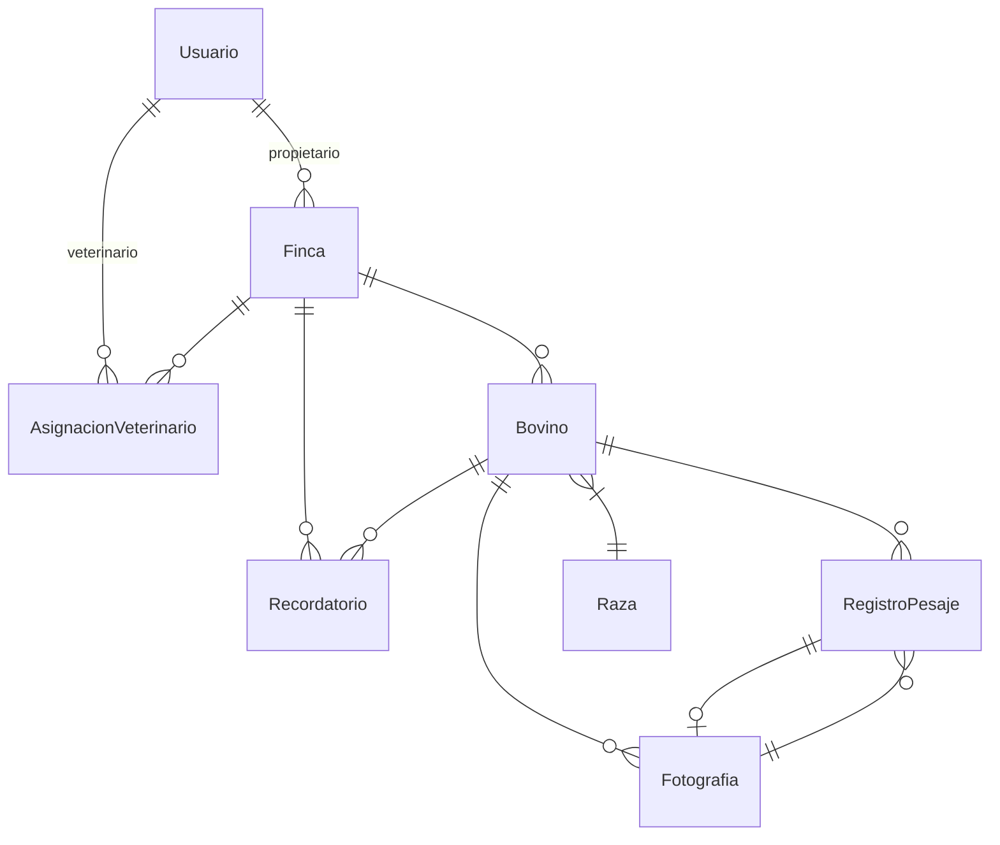
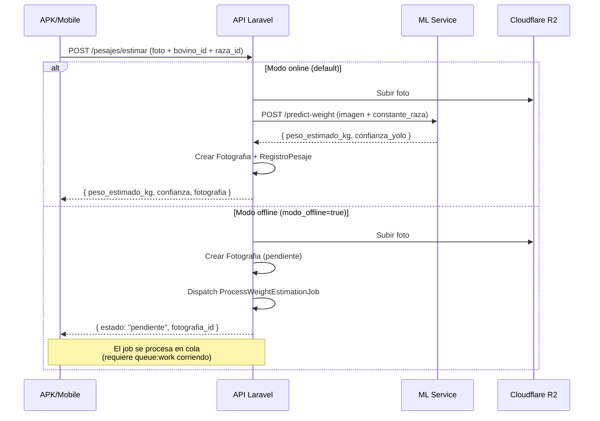

# Arquitectura

## Stack tecnológico

```
PHP 8.3+ → Laravel 13 → Sanctum → MySQL / SQLite → Railway
                                      ↓
                              Cloudflare R2 (fotos)
                                      ↓
                              ML Service (estimación peso)
```

## Modelos y relaciones



| Modelo | Tabla | Descripción |
|---|---|---|
| `Usuario` | `usuarios` | Usuarios con roles (`administrador`, `ganadero`, `veterinario`, `asistente`) |
| `Finca` | `fincas` | Fincas ganaderas con ubicación (provincia, cantón) |
| `Bovino` | `bovinos` | Animales con arete, raza, sexo, fechas |
| `Raza` | `razas` | Catálogo de razas con constantes de peso |
| `AsignacionVeterinario` | `asignaciones_veterinarios` | Relación veterinario ↔ finca |
| `Fotografia` | `fotografias` | Imágenes de bovinos, con estado de procesamiento |
| `RegistroPesaje` | `registros_pesaje` | Pesajes manuales o estimados por IA |
| `Recordatorio` | `recordatorios` | (Migración lista, sin endpoints) |
| `BitacoraActividad` | `bitacora_actividades` | Auditoría (helper existe, no se llama automáticamente) |

## Roles y autorización

### Sistema de roles

El campo `rol` en `usuarios` puede ser:

- `administrador` — acceso total. Gate `administrar-usuarios`.
- `ganadero` — dueño de fincas y bovinos. CRUD completo sobre sus recursos.
- `asistente` — mismos permisos que `ganadero` pero solo recursos propios.
- `veterinario` — acceso de lectura/escritura a fincas/bovinos/pesajes donde está asignado.

### Policies

| Policy | Recursos que protege |
|---|---|
| `FincaPolicy` | CRUD de fincas según rol y pertenencia |
| `BovinoPolicy` | Acceso a bovinos según finca asociada |
| `PesajePolicy` | Acceso a pesajes según bovino y finca |
| `AsignacionVeterinarioPolicy` | Solo el dueño de la finca o admin puede gestionar asignaciones |

### Asistente

El rol `asistente` se trata como `ganadero` para efectos de permisos: puede crear, ver, actualizar y eliminar sus propias fincas y bovinos.

## Flujo de estimación de peso por IA



### Estrategias de estimación

El `WeightEstimationOrchestrator` selecciona la estrategia:

- **OnlineStrategy** (default): llama al ML service síncronamente, devuelve resultado inmediato.
- **OfflineStrategy**: sube la foto, crea registro pendiente, encola job de procesamiento.

**Nota:** `isOnline()` siempre devuelve `true`. El modo offline solo se activa si el frontend envía `modo_offline=true`.

### ML Service Adapter

`App\Adapters\MLServiceAdapter` implementa `IEstimadorPeso`. Envía un multipart POST al endpoint configurado en `config/services.php` (`ml_service`). Incluye header `ngrok-skip-browser-warning: true`.

## Almacenamiento de imágenes

`ImageStorageService` guarda las fotos en el disco configurado (`local` en desarrollo, `r2` en producción).

Ruta en disco: `fotografias/{YYYY}/{MM}/{filename}.{ext}`

## Servicios principales

| Servicio | Ubicación | Propósito |
|---|---|---|
| `ImageStorageService` | `app/Services/` | Subida y organización de fotos |
| `WeightEstimationOrchestrator` | `app/Services/` | Orquestación de estimación de peso |
| `MLServiceAdapter` | `app/Adapters/` | Comunicación con el servicio de ML |
| `ApiResponse` | `app/Support/` | Helper de respuestas JSON uniformes |

## Componentes que faltan

- **Recordatorios:** migración y modelo existen, pero no hay controlador ni rutas.
- **Bitácora automática:** `BitacoraActividad::registrar()` existe pero no se invoca desde los controladores.
- **Registro público:** no hay endpoint de registro; los usuarios los crea un administrador.
- **Queue worker:** no se inicia automáticamente en Railway.
